<!-- markdownlint-disable MD028 MD029 MD036 -->

# Guide

This is the short version, see the [Manual](MANUAL.md) for a more detailed explanation.

**Overview**

1. [Hosting a draft](#hosting-a-draft)
2. [Joining an existing draft](#joining-an-existing-draft)
3. [Completing a draft](#completing-a-draft)

## Hosting a draft

1. ### Run `/match create` and select a game mode

This will create a Lobby and join you as the host. The `Join` button will open the Activity.

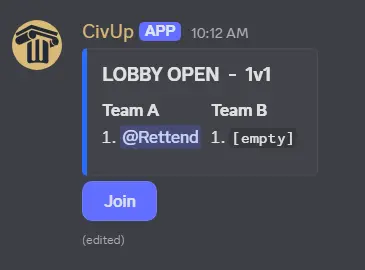

> [!IMPORTANT]
> The Lobby is this embed and it's separate from the Activity, you can open and close the Activity and it won't affect the Lobby. Think of the Activity as another view into the same underlying lobby.

2. ### Wait for players to join

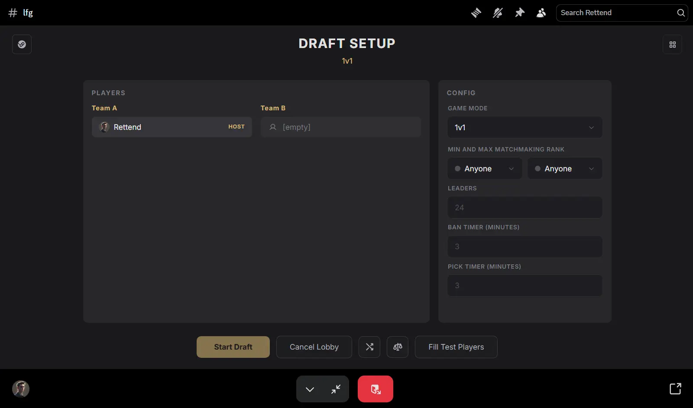

Once the Activity is open, you can see the players and the lobby settings. Drag players to move them around, and click on the `X` button next to a player to remove them. The host can move everyone, while players can only move themselves.

> [!NOTE]
>
> #### Steam lobby link
>
> Use the **Steam button** (top left) to set the steam lobby link. If set, it will turn golden and other players can click it to open the Civ lobby.
>
>  

> [!TIP]
> To keep the Activity open and still be able to use Discord, just minimize it and it turns into a small widget:
>
> 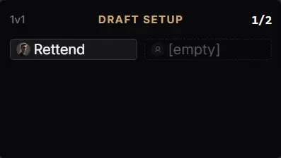

When the lobby is full, use the `Start Draft` button.

## Joining an existing draft

There are 3 ways to join a lobby:

- **Clicking the `Join` button on the lobby embed**: this opens the Activity and adds you to the lobby.

- **Opening the Activity directly**: when someone is in the Activity, it's possible to open it directly from the text channel

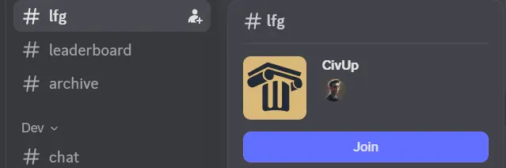

This opens the **Lobby Overview** page where you can see every lobby.

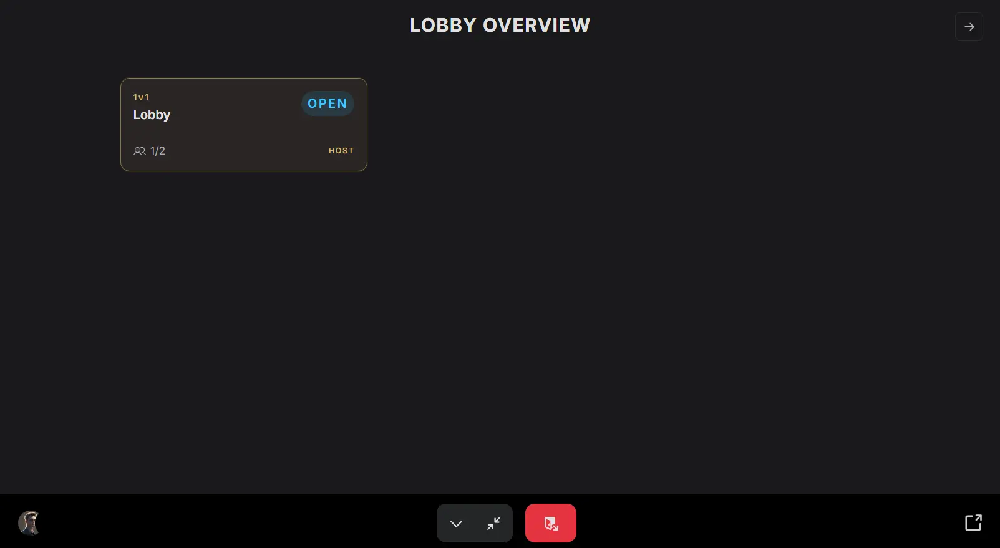

> [!NOTE]
> This can also be accessed using the **Lobby Overview button** (top right)
>
> 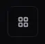

You can freely switch between lobbies by clicking on them, however, note that you will view them as a Spectator.

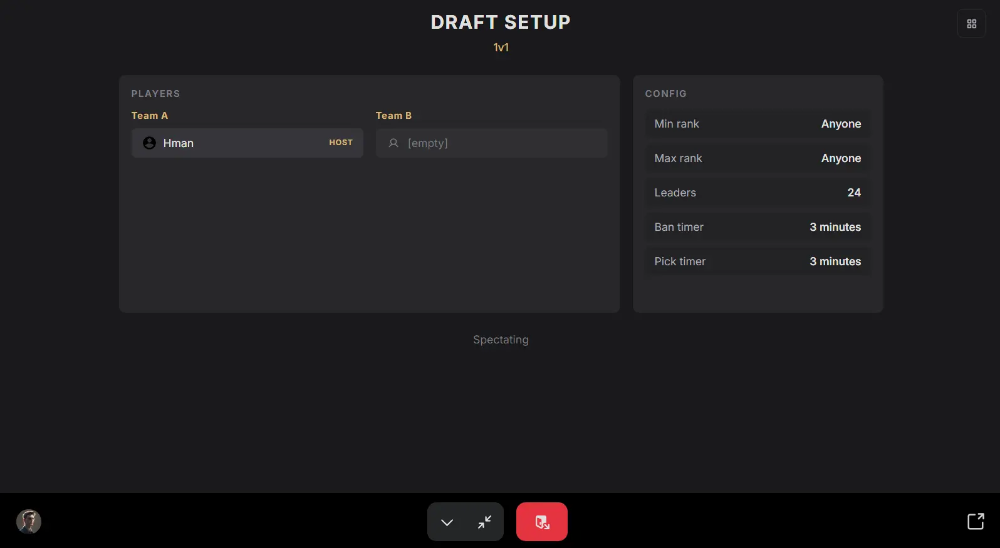

To actually join a lobby you need to click on a seat.

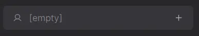

- **Using the `/match join` command**: this will try to find the best open lobby based on your rank.

## Completing a draft

After the draft has started, it displays the current and future phases, every player has a slot, and players currently picking are highlighted.

1. ### Ban phase

The leader pool consists of a random subset of leaders, and it's shared between all players.

> [!NOTE]
> Use the small **`^` button** (bottom center) to open up the leader grid
>
> 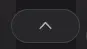

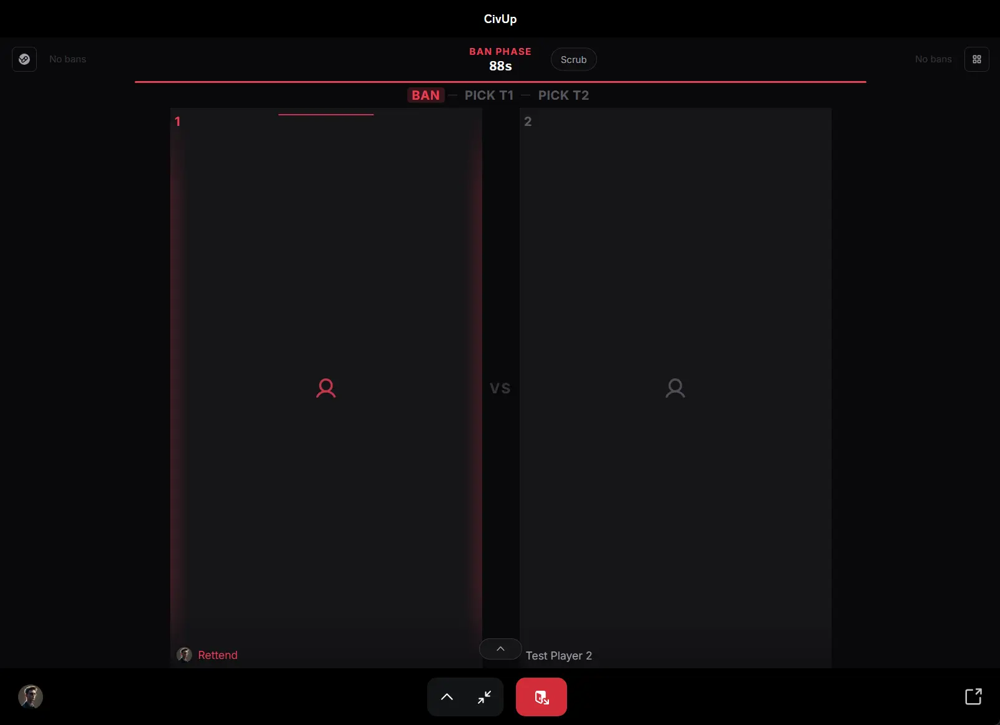

Bans are simultaneous and blind: everyone bans at the same time and the banned leaders are only revealed after everyone has finished banning. In team modes, only captains ban (the first seat in each team).

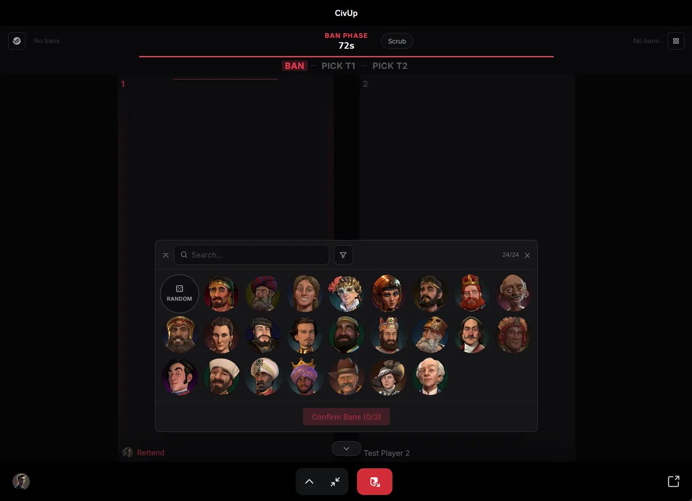

Click on leaders to select them, then use the `Confirm` button at the bottom to lock them in. Clicking on leaders also opens up a side pane with leader details, to open it without selecting the leader, use right click.

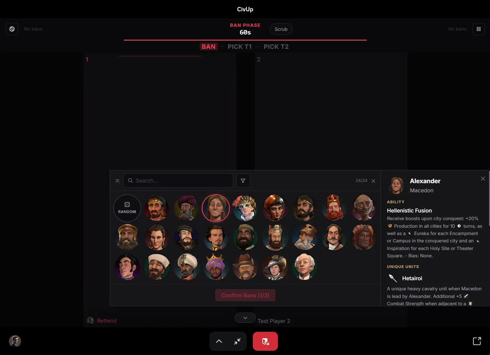

2. ### Pick phase

During the pick phase, clicking a leader displays it as 'hovered' to your teammates.

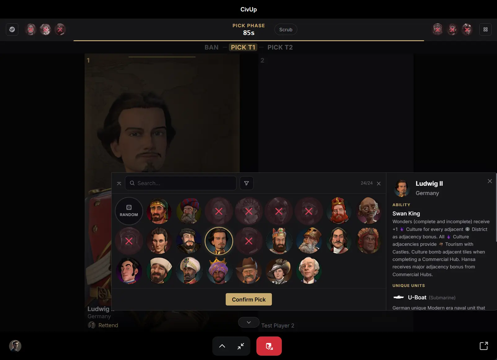

3. ### Report the result

After the draft is complete, the Activity can be closed. When the game is done, the host needs to select the winner by clicking on the player's leader and then `Confirm`.

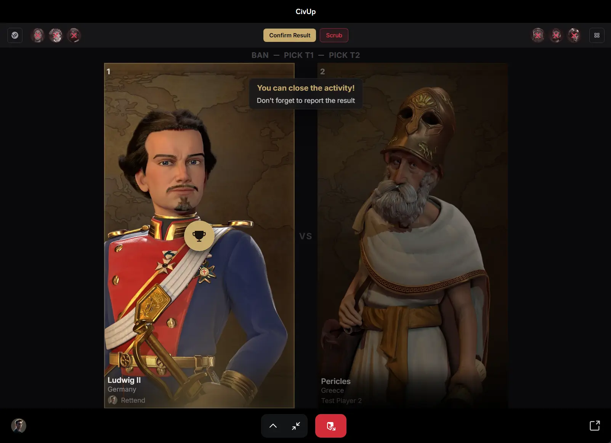
